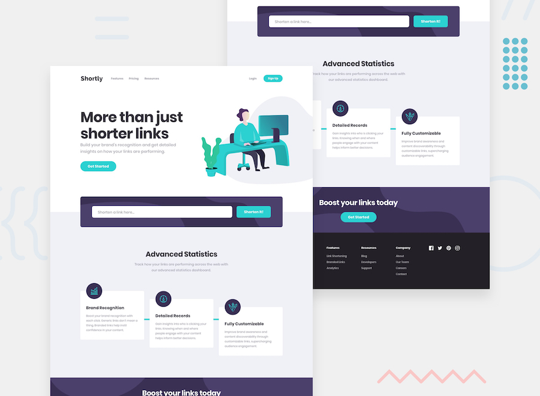

# Frontend Mentor - Shortly URL shortening API Challenge solution

This is a solution to the [Shortly URL shortening API Challenge challenge on Frontend Mentor](https://www.frontendmentor.io/challenges/url-shortening-api-landing-page-2ce3ob-G). The project matches the provided desktop and mobile designs and includes a working frontend URL-shortening flow.

## Table of contents

- [Overview](#overview)
  - [The challenge](#the-challenge)
  - [Screenshot](#screenshot)
  - [Links](#links)
- [My process](#my-process)
  - [Built with](#built-with)
  - [What I learned](#what-i-learned)
  - [Continued development](#continued-development)
  - [Useful resources](#useful-resources)
  - [AI Collaboration](#ai-collaboration)
- [Author](#author)

## Overview

### The challenge

Users should be able to:

- View the optimal layout for the site depending on their device's screen size
- Shorten any valid URL
- See a list of their shortened links, even after refreshing the browser
- Copy the shortened link to their clipboard in a single click
- Receive an error message when the `form` is submitted if:
  - The `input` field is empty

### Screenshot



### Links

- Solution URL: [Frontend Mentor profile](https://www.frontendmentor.io/profile/rafi983)
- Live Site URL: [Local development server](http://localhost:8080)

## My process

### Built with

- Semantic HTML5 markup
- CSS custom properties
- Flexbox
- CSS Grid
- Mobile-first responsive workflow
- [Vue 3](https://vuejs.org/) - JavaScript framework
- [Vue CLI](https://cli.vuejs.org/) - Tooling and development server
- Browser `localStorage` for persistence

### What I learned

This challenge helped reinforce how to combine design accuracy with interactive functionality in one page.

- I practiced building a landing page with multiple sections that match a static mockup across desktop and mobile breakpoints.
- I implemented a lightweight frontend URL-shortening flow with validation, generated short codes, and persistent storage.
- I improved handling UI states such as input errors, copied button state changes, and conditional mobile navigation.

One useful pattern in this project is generating unique short codes while avoiding collisions with existing links:

```js
generateCode() {
  let code = ''

  do {
    code = Array.from({ length: CODE_LENGTH }, () => CHARS[Math.floor(Math.random() * CHARS.length)]).join('')
  } while (this.links.some((link) => link.code === code))

  return code
}
```

### Continued development

In future iterations, I want to:

- Replace localStorage-based data with a backend API and database so short links work across devices.
- Add custom aliases (e.g. `/my-link`) and expiration options.
- Improve accessibility further with keyboard-focus refinements and additional ARIA support in the mobile menu.
- Add automated component and end-to-end tests for form validation and redirect behavior.

### Useful resources

- [Vue 3 documentation](https://vuejs.org/guide/introduction.html) - Helped with component state, conditional rendering, and event handling.
- [MDN Web Docs - URL API](https://developer.mozilla.org/en-US/docs/Web/API/URL) - Used for validating and normalizing input links.
- [Frontend Mentor style guide](./style-guide.md) - Used as the source of typography, spacing, and color direction.

### AI Collaboration

No AI used.

## Author

- Frontend Mentor - [@rafi983](https://www.frontendmentor.io/profile/rafi983)
